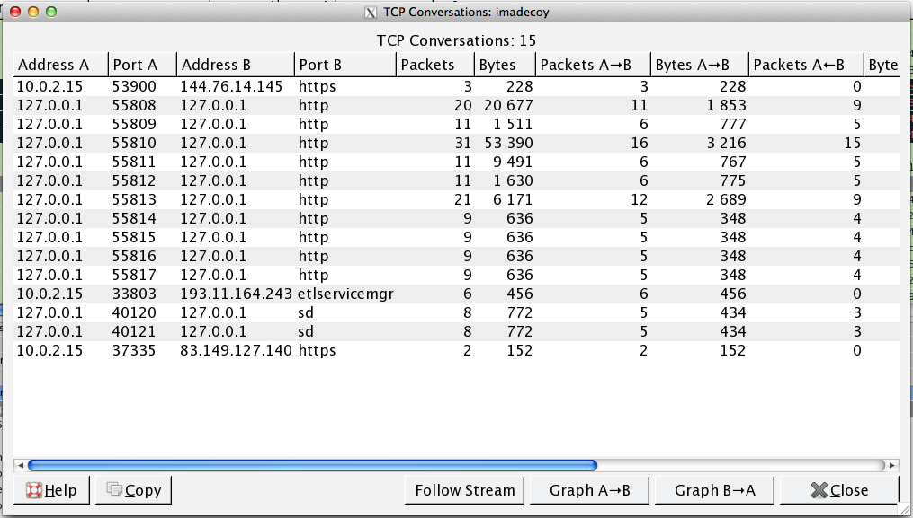
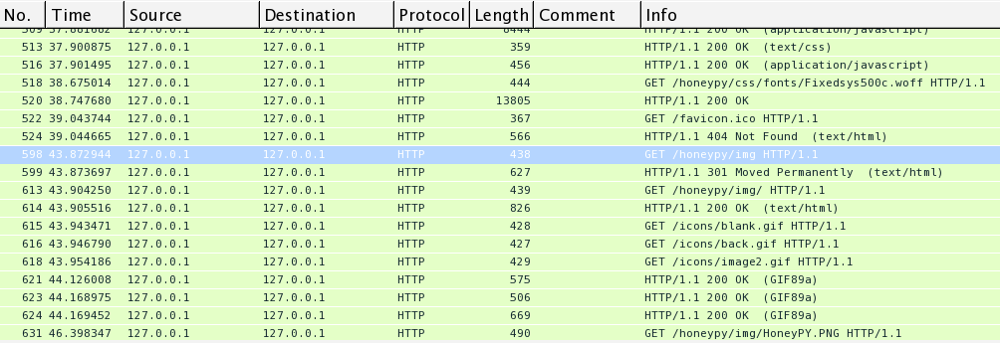

# Level 13

## Description

A page with the message:

>

## Solution

Guessing at some common backup filenames, (.bak, etc), we can find the original PHP code at: `http://ctf.infosecinstitute.com/levelthirteen.php.old`

If we compare this to the original file, we can see some comments are now missing:

```diff
--- levelthirteen.php   2015-03-15 16:49:37.798172357 -0400
+++ levelthirteen.php.old       2015-03-15 16:49:34.082172505 -0400
@@ -81,12 +81,24 @@
     I'm sorry for messing up :(

     </h1>
-
+    <?php

+    /*  <br /> <br />
+
+    <p>Do you want to download this mysterious file?</p>
+
+    <a href="misc/imadecoy">
+      <button class="btn">Yes</button>
+    </a>
+
+    <a href="index.php">
+      <button class="btn">No</button>
+    </a>
+    */
+
+    ?>
   </div>

-<center> <br /><br /><br /><p style="font-size:.9em;font-weight:normal;">Bounty: $130</p></center>
-
   <script src="js/jquery.js"></script>
   <script src="js/bootstrap.min.js"></script>
   <script src="js/custom.js"></script>
```

So, let's fetch the mysterious file!

```shell
$ curl -s -O http://ctf.infosecinstitute.com/misc/imadecoy
$ file imadecoy
imadecoy: tcpdump capture file (little-endian) - version 2.4 (Linux "cooked", capture length 65535)
$
```

Cool, a tcpdump file.  TCPDUMP is a *ix utility that allows you to snoop on network traffic on a machine.  We can open this file in [Wireshark](https://www.wireshark.org/).

## Wireshark

Wireshark is a GUI version of TCPDUMP that can run on a saved capture file (or capture itself, but that isn't relevant right now).  We can ask Wireshark (via Statistics -> Conversation List -> TCP) for a list of what hosts are talking to each other in this capture.  If we do so, we see a number of conversations on 127.0.0.1 (localhost):



If we apply the following filter, we can see only the HTTP conversations to 127.0.0.1: `ip.addr==127.0.0.1 && tcp.port==80 && http`, and when we do so we see that someone appears to be browsing to `http://127.0.0.1/honeypy`.  However, shortly after loading this page we see that the enterprising young hacker browsing this site has attempted to get a listing of the img/ directory (see the highlighted packet, and the time difference between it and the request above):



If we ignore the icons in the list, we notice that there's a HoneyPY.PNG fetched a few times - this must be important.

If we click on packet 633 (the 200 response containing the actual HoneyPY.PNG) we can extract this file from the capture by right clicking on the "Portable Network Graphics" line at the bottom of the data section, and picking "Export Selected Packet Bytes...".

If we do that and then open the resulting PNG file in a viewer, we get a gray screen that says:

`infosec_flagis_morepackets`

## Flag

`infosec_flagis_morepackets`
